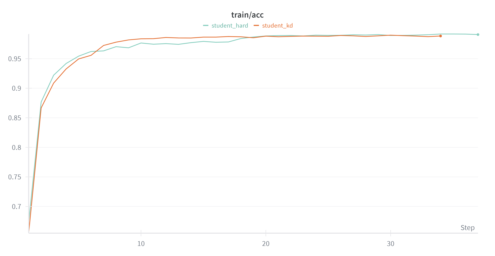
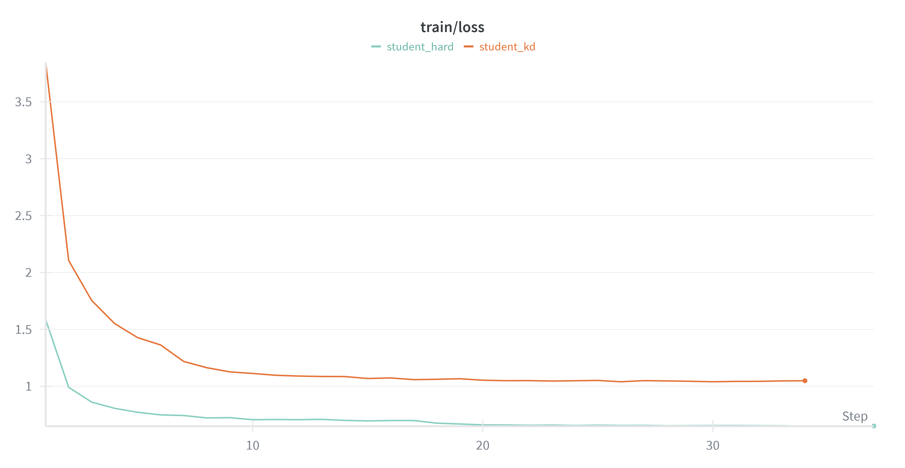
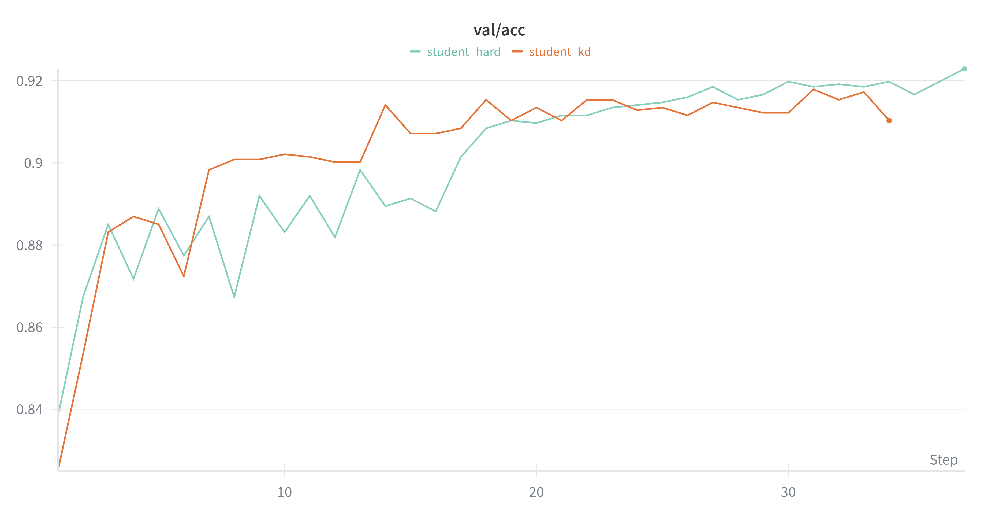
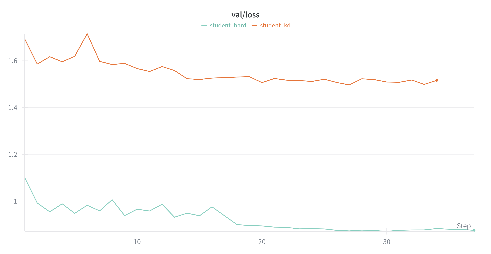

# Low-Resolution Bird Image Classification with Knowledge Distillation

본 프로젝트는 **저해상도(64×64) 조류 이미지 환경에서 Knowledge Distillation(KD)가 분류 성능 향상에 얼마나 효과적인지**를 검증하는 것을 목표로 합니다.

동일한 샘플에 대해  
- **고해상도(HR, x4 Upscale) 이미지를 입력으로 사용하는 Teacher 모델**과  
- **저해상도(LR) 이미지를 입력으로 사용하는 Student 모델**을 구성하고,  

Teacher의 예측 분포(soft targets)를 Student 학습에 활용하여  
단순 Hard-label 학습 대비 성능 차이를 분석합니다.

---

## 1. Motivation

저해상도 이미지에서는 다음과 같은 문제가 발생합니다.

- 세부 질감 및 형태 정보 손실
- 클래스 간 경계가 모호해짐
- Hard label 기반 학습의 일반화 한계

본 프로젝트는 **HR 이미지로 학습된 Teacher가 가진 클래스 간 관계 정보를  
softmax 분포 형태로 전달**함으로써,  
LR 환경에서도 Student 모델이 더 풍부한 표현을 학습할 수 있는지를 확인합니다.

---

## 2. Dataset

본 프로젝트는 DACON의 공개 경진대회 데이터를 기반으로 합니다.  
데이터는 저해상도 조류 이미지와 해당 이미지의 x4 Upscale 버전으로 구성되어 있습니다.

- Dataset source: https://dacon.io/competitions/official/236251/overview/description

### Dataset Structure

data/
├── train/
│ ├── TRAIN_00000.jpg
│ ├── ...
│ └── TRAIN_15833.jpg
├── test/
│ ├── TEST_00000.jpg
│ ├── ...
│ └── TEST_06785.jpg
├── upscale_train/
│ ├── TRAIN_00000.png
│ ├── ...
│ └── TRAIN_15833.png
├── train.csv
└── test.csv


### File Description

- **train/**
  - 학습용 64×64 저해상도 조류 이미지 (15,834장)

- **test/**
  - 평가용 64×64 저해상도 조류 이미지 (6,786장)

- **upscale_train/**
  - 학습용 저해상도 이미지를 x4 Upscale한 256×256 PNG 이미지

- **train.csv**
  - `img_path` : 저해상도 이미지 경로  
  - `upscale_img_path` : Upscale 이미지 경로  
  - `label` : 조류 종 (총 25 클래스)

- **test.csv**
  - `ID` : 샘플 고유 ID  
  - `img_path` : 저해상도 이미지 경로  


### Dataset Statistics

- Total samples (train): 15,834  
- Number of classes: 25  
- Class distribution: 비교적 균형적인 분포 (약 430 ~ 670 samples per class)

---

## 3. Methodology

### Overall Pipeline

1. **Teacher Training**
   - 입력: HR (x4 Upscale) 이미지
   - Objective: Cross-Entropy Loss

2. **Student Training (Baseline)**
   - 입력: LR 이미지
   - Objective: Cross-Entropy Loss

3. **Student Training (Knowledge Distillation)**
   - 입력:
     - Student: LR 이미지
     - Teacher: HR 이미지
   - Objective:
     - Hard Loss: Cross-Entropy(Student, Ground Truth label)
     - Soft Loss: KL Divergence(Student logits, Teacher logits)
   - Total Loss:
     ```
     L = α · L_hard + β · L_soft
     ```

### Knowledge Distillation Setting

- Temperature (T): 4.0  
- Hard loss weight (α): 0.7  
- Soft loss weight (β): 0.3  

Teacher 모델은 사전 학습 후 **freeze**하여 Student 학습 동안 업데이트하지 않습니다.

---

## 4. Experimental Setup

- Backbone: ResNet50 (torchvision, ImageNet pretrained)
- Optimizer: AdamW
- Learning Rate Scheduler: ReduceLROnPlateau
- Early Stopping applied
- Train / Validation / Test split: 8 : 1 : 1 (stratified)

환경 및 의존성 정보는 `requirements.txt`에 별도로 정리합니다.

공정한 비교를 위해 baseline Student와 KD Student는
동일한 backbone과 하이퍼파라미터 설정으로 학습했습니다.
두 모델 간의 성능 차이는 Knowledge Distillation 적용 여부에서만 발생합니다.

---

## 5. Results

### Test Accuracy Comparison

| Model | Input | Training Objective | Test Accuracy |
|------|------|--------------------|---------------|
| Teacher | HR | Hard Loss | 97.66% |
| Student (Baseline) | LR | Hard Loss | 90.15% |
| Student (KD) | LR + HR (Teacher) | Hard + Soft Loss | 91.73% |

Knowledge Distillation을 적용한 Student는  
LR Hard-label baseline 대비 **+1.58%p 성능 향상**을 보였습니다.


### Learning Curves

#### Train



#### Validation



---

## 6. Conclusion

본 실험을 통해 다음을 확인할 수 있습니다.

- 저해상도 환경에서는 Hard-label 학습만으로 성능에 한계가 존재
- HR 이미지로 학습된 Teacher의 예측 분포는 유의미한 추가 정보 제공
- Knowledge Distillation은 LR 이미지 분류 성능을 안정적으로 개선

본 프로젝트는 최고 성능을 목표로 한 대회용 접근이 아니라,  
**저해상도 입력 조건에서 KD 기법의 효과를 체감하고 분석하는 데 목적**을 두었습니다.  
향후 하이퍼파라미터 튜닝 및 모델 구조 개선을 통해  
추가적인 성능 향상이 가능할 것으로 기대됩니다.

---

## 7. Repository Structure

├── assets/ # Training curves and result figures
├── src/ # Model, dataset, training utilities
├── train_teacher.py
├── train_student.py
├── train_kd_student.py
├── test_teacher.py
├── test_student.py
├── test_kd_student.py
├── check_data.py
├── README.md
├── LICENSE
└── requirements.txt